# Ispettore

A Chrome DevTools panel for debugging **Three.js, WebGL, and WebGPU** applications. It captures
one frame of real GPU activity and lets you browse every draw, clear, blit, and copy in it —
with the color output each one produced, the full render pipeline state, and (for Three.js
apps) which object, material, and pass each draw belongs to.

Think of it as Spector.js's live GPU capture combined with a RenderDoc-style pipeline
inspector, with Three.js scene awareness built in.

## Features

- **Live frame capture for WebGL 1/2** — arm the next animation frame (or an on-demand render
  burst) and get back every GPU event it contained, with a baked color image for each one.
- **Three.js scene awareness** — events are linked back to the mesh, material, and
  post-processing pass that produced them, so you can filter a capture down to one object in
  the scene tree.
- **RenderDoc-style pipeline inspection** — for any event, step through Vertex Input, Vertex
  Shader, Rasterizer, Fragment Shader, and Output Merger: draw arguments, vertex/index buffer
  contents, uniform values, bound textures, blend/depth/stencil state, and viewport/scissor —
  each tagged as set, redundant, or disabled, the way Spector.js does.
- **Call Info** — command name with its MDN documentation, CPU/GPU duration, call arguments,
  and the JavaScript stack trace that issued it.
- **WebGPU capture (experimental)** — pass-final color images and texture-copy outputs, WGSL
  shader modules, bind groups, and compute dispatch details, with the same capture-then-inspect
  model as WebGL.
- **CPU time and GPU time, kept separate** — per-event CPU issue time next to live GPU duration
  (WebGL, where the browser exposes a timer extension), instead of one conflated number.
- **Stored captures, export, import, and diff** — every capture survives page navigation and
  closure; save it as a portable JSON file, reload it later, or diff two captures side by side.
- **Never runs your code to show you data** — inspecting a capture only reads back what was
  recorded live. It never re-executes shaders, recreates GPU resources, or replays your
  application. See [Architecture](#architecture) below.

### Screenshots

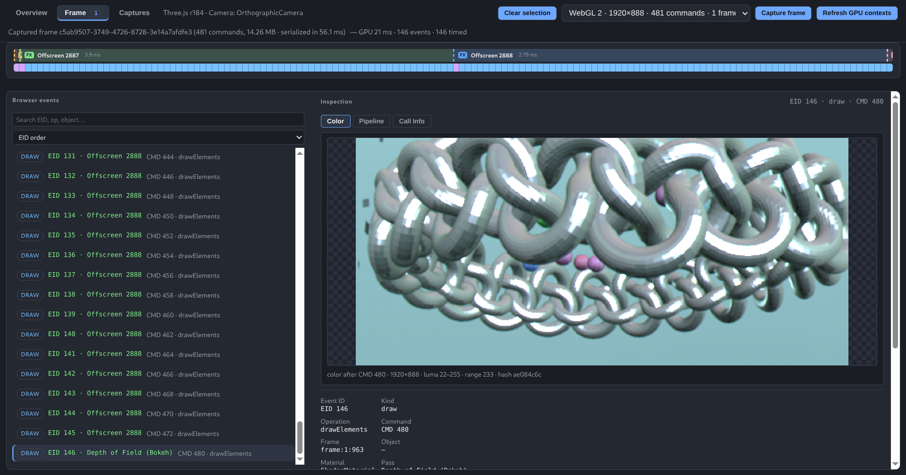

**Three.js scene awareness** — the Overview scene tree, and a capture filtered down to one
scene object:

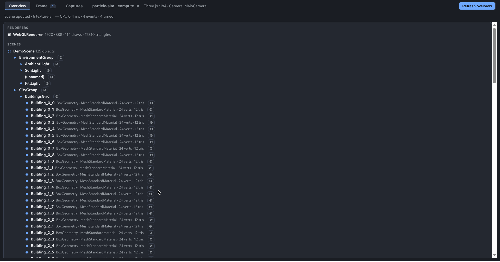
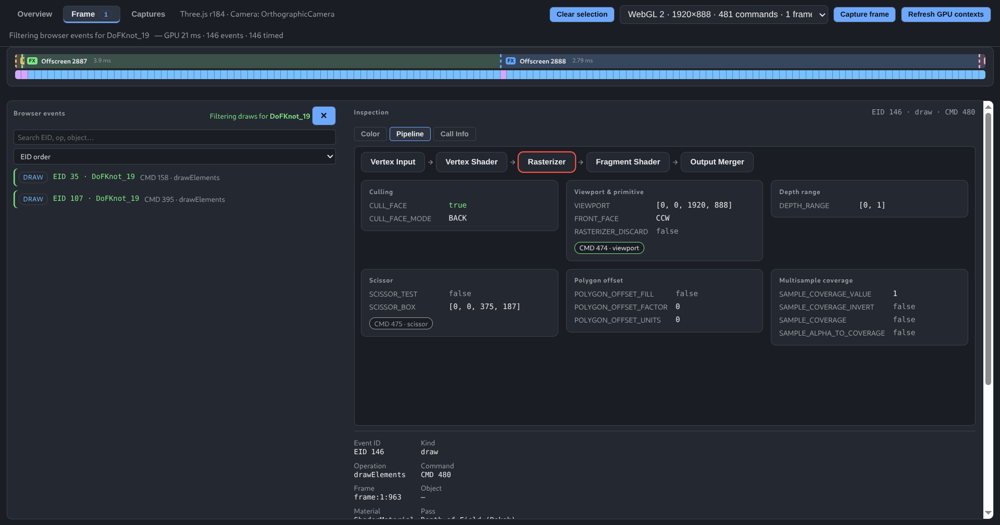

**RenderDoc-style pipeline inspection** — step through pipeline stages, or open a draw's
shader source (GLSL or WGSL):

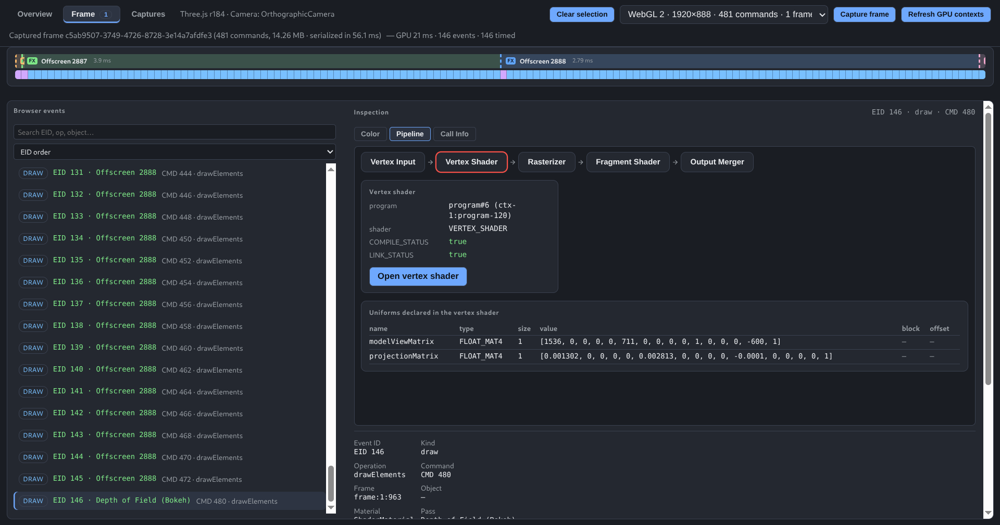
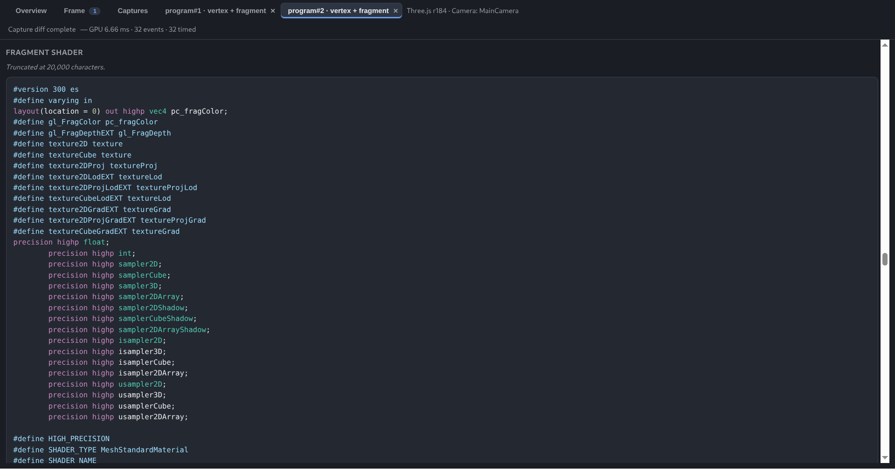
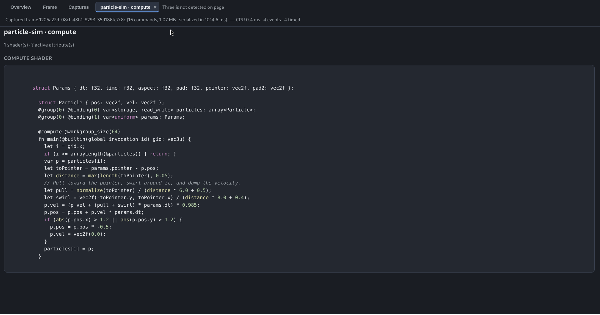

**WebGPU capture (experimental)** — a compute dispatch's pipeline state, bind group, and
buffer contents:

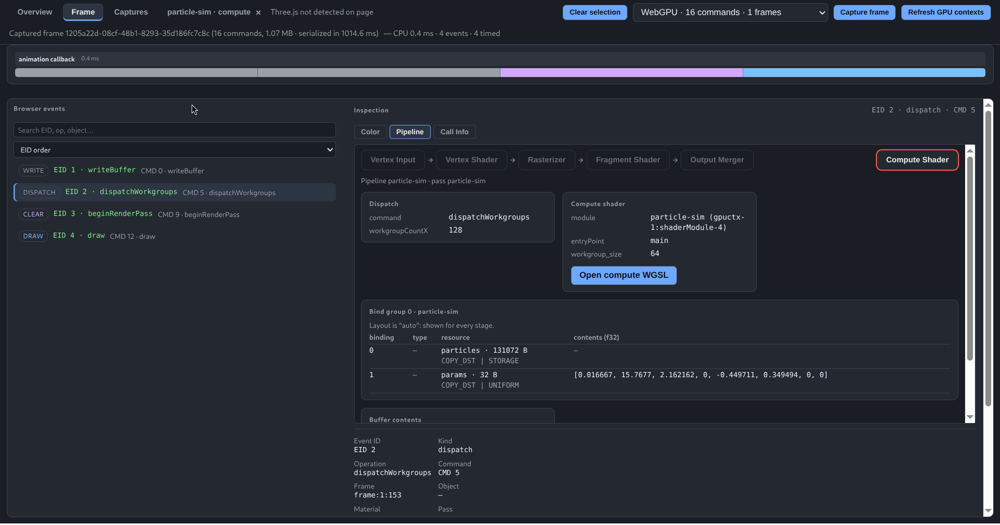

**CPU time and GPU time, kept separate** — per-pass cost timelines for post-processing chains:

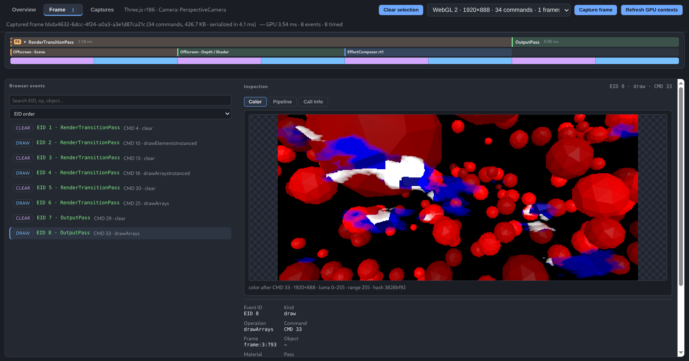
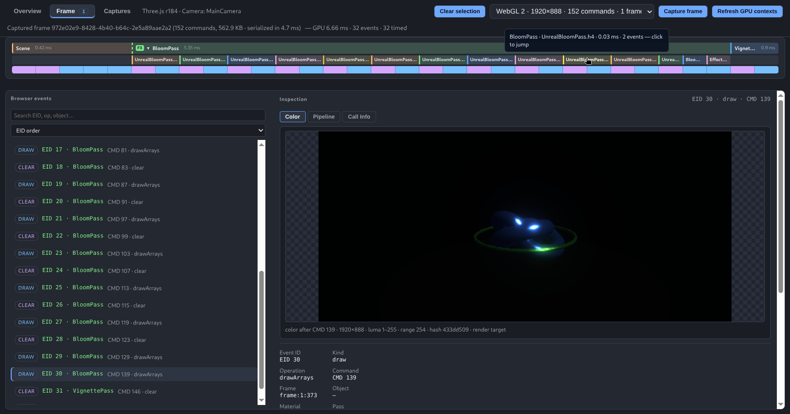

**Stored captures, export, import, and diff** — manage stored captures, and compare two of
them side by side:

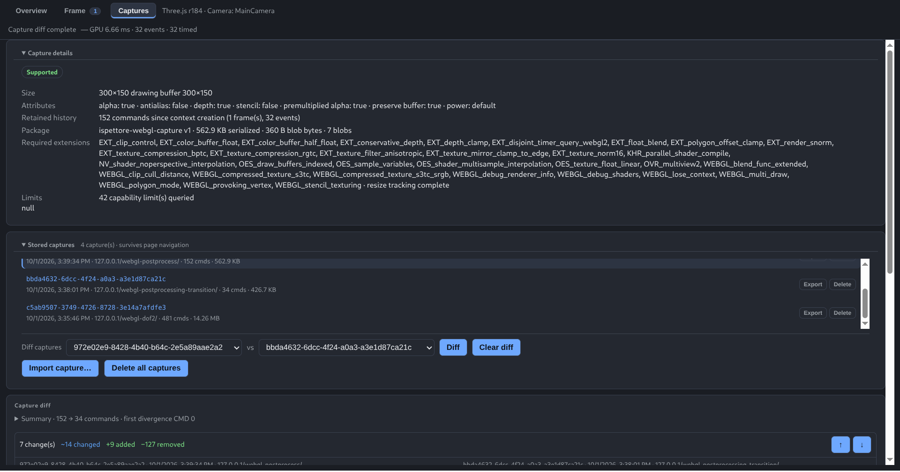
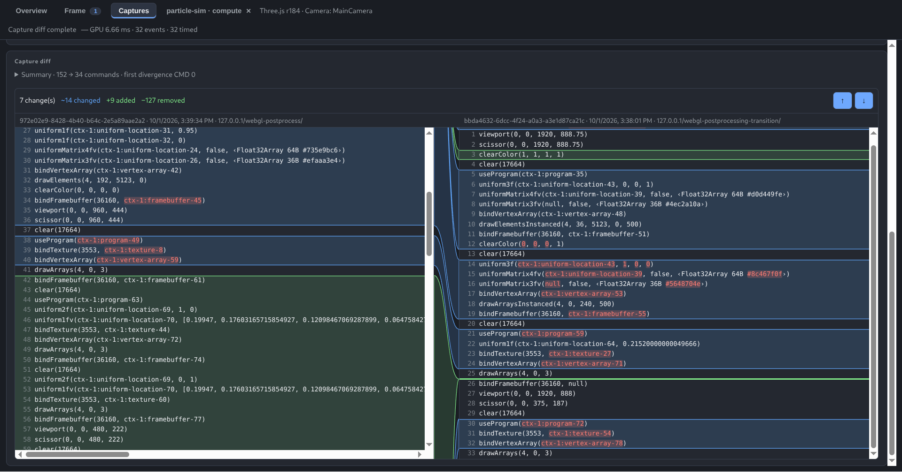

## Three.js support

| Three.js version / application | Support level | What to expect |
|---|---|---|
| **r184 (`three@0.184.0`)** | Tested target | Pinned development, demo, and automated browser-test target for scene observation, `EffectComposer` pass hooks, and live frame capture. Newer revisions are best effort until added to the regression matrix. |
| **r106–r183** | Best effort | The `__THREE_DEVTOOLS__` observation bridge exists, but these revisions are not part of the regression matrix. Composer annotations and capture coverage may differ. |
| **Before r106** | Low-level capture only, unsupported | WebGL interception may still record events, but Three.js scene discovery and live re-render inspection are unsupported. |
| **WebGL without Three.js** | Best effort | API-level events and resources can be captured; Three.js scene, mesh, material, and composer metadata are unavailable. |

## Install locally (unpacked)

Ispettore isn't on the Chrome Web Store yet — install it as an unpacked extension:

```bash
npm ci
npm run build
```

1. Open Chrome → `chrome://extensions`
2. Enable **Developer mode**
3. Click **Load unpacked**
4. Select the generated `ispettore/dist/` folder

After reloading the extension, **reload any open WebGL/WebGPU tabs** once so they pick up the
current capture hooks.

Ispettore needs to see `http`, `https`, and `file` pages to observe their GPU contexts, so
Chrome will ask for access to all sites when you load it. Nothing is sent off your machine:
captures are stored locally in the extension's own IndexedDB.

Once installed, open any WebGL/WebGPU page, press **F12**, choose the **Ispettore** tab, open
the **Frame** sub-tab, and click **Capture frame**. (The side panel via the toolbar icon also
works; DevTools is recommended.)

## Architecture

Ispettore uses a **live capture, stored-data inspection** model for both WebGL and WebGPU: it
records one armed frame of real GPU activity, bakes the color output of each significant event
while the page actually renders it, and stores that frame as one self-contained package.
Browsing an event afterward — selecting it in the event list, stepping through pipeline
stages, scrubbing commands — is a pure lookup against that stored package.

Selecting an event **never** executes a captured GPU command, reconstructs a GPU resource,
requests a device/context, or calls back into your application. If something wasn't captured,
the panel says so explicitly instead of guessing or re-running your code to generate it.

This is a deliberate trade-off against the alternative (replaying recorded commands in an
isolated context to reconstruct arbitrary state): that approach scales badly with long-running
scenes and can diverge from what actually happened on screen. Capturing observable output
live, once, trades the ability to synthesize data that was never recorded for guaranteed
correctness and bounded capture cost.

Contributors can start from `src/README.md` (source layout) and `tests/README.md` (running
the test suite).

## License

Apache License 2.0 — see [LICENSE](LICENSE) and [NOTICE](NOTICE).
